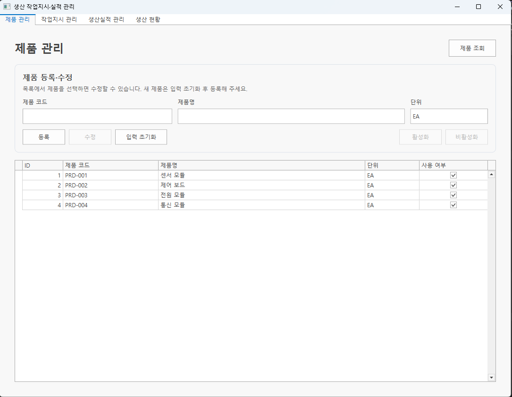
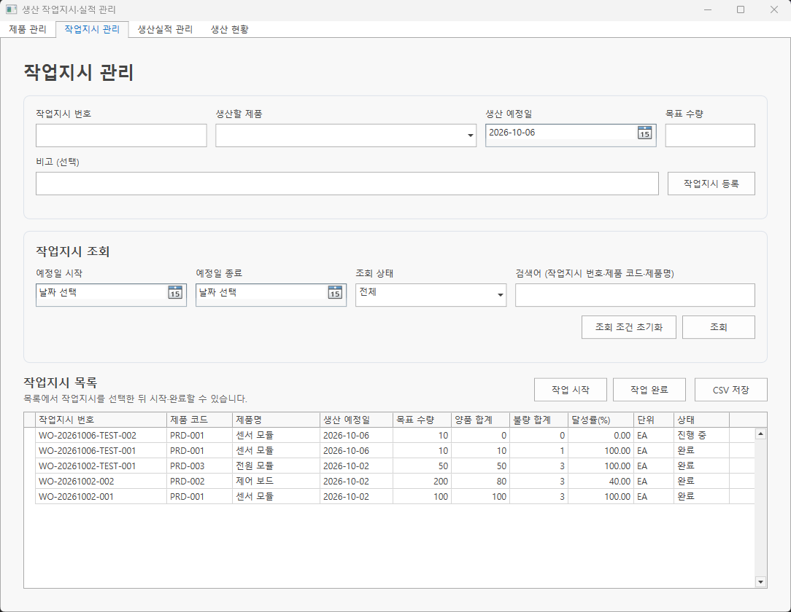
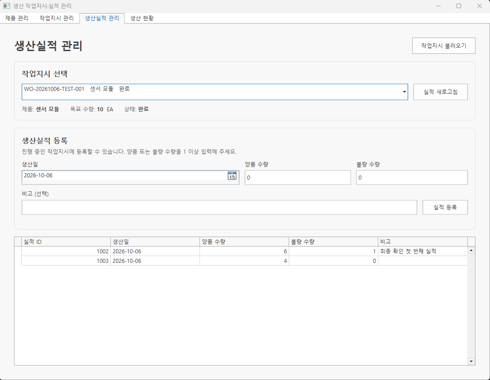
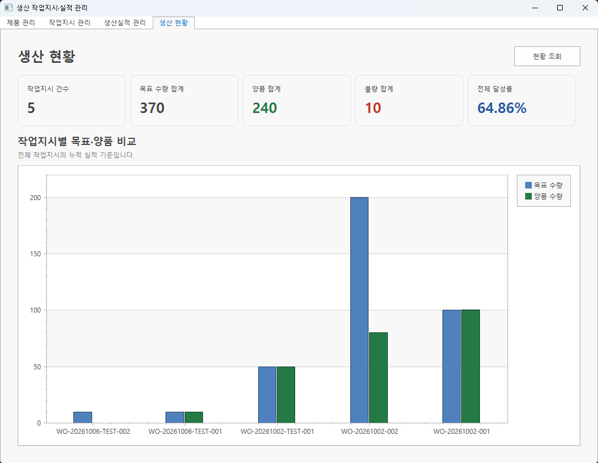

# 생산 작업지시·실적 관리 프로그램

> C#·WPF·DevExpress·MSSQL 기반으로 제품과 생산 작업지시, 양품·불량 실적을 관리하고 목표 대비 생산 현황을 확인하는 Windows 프로그램

## 프로젝트 개요

| 구분 | 내용 |
| --- | --- |
| 개발 형태 | 개인 프로젝트 |
| 개발 기간 | 2026.10 |
| 구현 범위 | 제품 관리, 작업지시 등록·상태 관리, 생산실적 등록·조회, 생산 현황 집계, CSV 저장 |
| 언어·프레임워크 | C#, WPF, .NET 10 |
| UI 컴포넌트 | DevExpress WPF |
| 데이터베이스 | SQL Server 2022 |
| DB 연동 | Microsoft.Data.SqlClient |
| 실행 환경 | Windows |
| 개발 도구 | Visual Studio, Docker Desktop, DBeaver, GitHub Desktop |

## 프로젝트 소개

생산 업무에서는 어떤 제품을 언제 몇 개 생산할지 계획하고, 실제 생산된 양품·불량 수량을 기록하여 목표 대비 진행 상황을 확인하는 과정이 필요합니다.

이 프로젝트는 제품 정보를 바탕으로 작업지시를 등록하고, 작업 시작부터 생산실적 기록과 완료 처리까지 연결한 Windows 프로그램입니다.

제품 관리, 작업지시 관리, 생산실적 관리, 생산 현황을 네 화면으로 구성했습니다. 작업지시별 누적 실적과 달성률을 조회하고, 전체 생산 현황을 집계 카드와 막대그래프로 확인할 수 있습니다.

입력 검증과 DB 제약조건을 함께 적용하고, 비동기 DB 처리와 오류 안내를 통해 조회·저장 실패 상황을 처리하도록 구현했습니다.

## 주요 기능

### 1. 제품 관리

- 제품 코드·제품명·단위 등록
- 제품 목록 조회 및 제품명·단위 수정
- 제품 활성화·비활성화
- 제품 코드 중복 및 필수 입력 검사
- 등록·수정 입력 영역 통합
- 기본 수량 단위 `EA` 적용

### 2. 작업지시 관리

- 활성 제품을 선택하여 작업지시 등록
- 생산 예정일·목표 수량·비고 입력
- 작업지시 번호 중복 및 목표 수량 검사
- 생산 예정일 범위·작업 상태별 조회
- 작업지시 번호·제품 코드·제품명 검색
- 작업 시작·완료 및 확인창 제공
- 작업지시별 양품·불량 합계와 달성률 표시
- 현재 조회된 작업지시 목록의 CSV 저장

### 3. 생산실적 관리

- 작업지시 목록 불러오기
- 선택한 작업지시의 제품·목표 수량·상태 표시
- 작업지시별 개별 생산실적 조회
- 생산일·양품 수량·불량 수량·비고 등록
- 진행 중인 작업지시에만 실적 등록
- 음수·문자 입력 및 양품·불량이 모두 0인 실적 차단

### 4. 생산 현황

- 전체 작업지시 건수 표시
- 목표 수량·양품·불량 합계 표시
- 전체 목표 대비 달성률 계산
- DevExpress 막대그래프로 작업지시별 목표·양품 수량 비교

## 주요 화면

### 제품 관리

등록과 수정에 같은 입력 영역을 사용합니다. 목록에서 제품을 선택하여 제품명·단위와 사용 여부를 변경할 수 있습니다.



### 작업지시 관리

작업지시 등록 영역과 조회 조건을 구분하고, 목록에서 작업 시작·완료와 CSV 저장을 처리합니다.



### 생산실적 관리

작업지시를 선택해 기존 실적을 조회하고, 진행 중인 작업에 양품·불량 수량을 기록합니다.



### 생산 현황

집계 카드와 막대그래프로 전체 생산 실적과 작업지시별 목표 대비 양품 수량을 확인합니다.



화면 캡처에는 초기 SQL 샘플 외에 프로그램에서 등록한 기능 확인용 데이터가 포함되어 있습니다.

## 데이터 흐름

### 작업지시 등록 및 생산실적 처리

1. 제품관리에서 생산할 제품을 등록합니다.
2. 작업지시 화면에서 활성 제품과 생산 예정일·목표 수량을 입력합니다.
3. 입력 검사를 통과한 작업지시를 DB에 대기 상태로 저장합니다.
4. 사용자가 작업 시작을 처리하면 진행 중 상태로 변경합니다.
5. 생산실적 화면에서 해당 작업지시의 양품·불량 수량을 등록합니다.
6. 작업지시를 조회하면 개별 실적을 합산하여 누적 수량과 달성률을 표시합니다.
7. 사용자가 작업 완료를 처리하면 완료 상태로 변경하고 추가 실적 등록을 차단합니다.

### 생산 현황 조회

1. 전체 작업지시와 작업지시별 누적 실적을 조회합니다.
2. 목표 수량·양품·불량 합계와 전체 달성률을 계산합니다.
3. 집계 결과를 생산 현황 카드에 표시합니다.
4. 작업지시별 목표 수량과 양품 수량을 차트에 반영합니다.

### CSV 저장

1. 사용자가 조회 조건으로 작업지시 목록을 검색합니다.
2. CSV 저장을 선택하고 파일 경로를 지정합니다.
3. 현재 화면에 조회된 목록을 CSV로 저장합니다.

## 주요 구현 내용

### 화면 데이터와 DB 처리 역할 분리

화면에 연결되는 입력값·선택값·목록은 ViewModel에서 관리하고, 입력 검증과 작업 처리 규칙은 Service에 구성했습니다.

Repository는 SQL 조회·저장을 담당하고, SqlConnectionFactory는 환경 변수의 연결 문자열을 읽어 DB 연결 객체를 생성합니다.

WPF 데이터 바인딩과 `INotifyPropertyChanged`, `ObservableCollection`을 사용하여 값과 목록 변경을 화면에 반영했습니다. 버튼 이벤트와 확인창·오류 안내는 화면 코드에서 처리합니다.

### 작업 상태에 따른 실적 등록 제한

작업지시는 `Waiting → InProgress → Completed` 상태로 관리합니다.

작업 시작과 완료는 현재 상태를 조건으로 SQL을 실행하여 허용된 상태에서만 변경하도록 구성했습니다.

실적 등록도 DB에서 작업지시가 진행 중인지 확인한 뒤 수행합니다. 등록 SQL의 `UPDLOCK`, `HOLDLOCK`을 통해 상태 확인과 실적 저장 중 같은 작업지시의 상태 변경을 제어하도록 구성했습니다.

목표 수량을 달성해도 자동 완료하지 않으며, 사용자가 명시적으로 완료 처리합니다.

### 누적 실적과 달성률 계산

작업지시 하나에 여러 생산실적을 연결하고, 조회 시 양품·불량 수량을 합산합니다.

실적이 없는 작업지시도 목록에 포함하고 합계를 0으로 표시합니다. 누적 수량은 SQL에서 `BIGINT`로 변환하여 합산합니다.

- 작업지시 달성률: `누적 양품 수량 ÷ 목표 수량 × 100`
- 전체 달성률: `전체 양품 합계 ÷ 전체 목표 합계 × 100`

전체 달성률은 작업지시별 달성률의 단순 평균 대신 전체 수량을 기준으로 계산합니다. 전체 목표 수량이 0이면 달성률을 0으로 표시합니다.

### 작업지시 조회와 제품 목록 갱신 분리

초기에는 작업지시 조회 시 등록용 제품 목록도 함께 갱신하여, 등록 중 선택한 제품이 해제되는 문제가 있었습니다.

작업지시 목록 조회와 활성 제품 목록 갱신을 별도 메서드로 분리했습니다. 작업지시 조회 버튼은 작업지시 목록만 갱신하고, 작업지시 탭에 들어올 때 최신 활성 제품 목록을 반영하도록 변경했습니다.

기존 선택 제품이 활성 상태이면 제품 ID를 기준으로 선택을 유지하고 변경된 제품명을 반영합니다. 비활성화된 제품은 목록에서 제외하고 선택을 해제합니다.

### 입력 검증과 DB 제약조건 적용

프로그램에서 필수 입력, 문자열 길이, 수량, 날짜 조회 범위를 검사합니다. 제품 코드와 작업지시 번호가 중복되면 사용자에게 안내합니다.

DB에도 UNIQUE·FOREIGN KEY·CHECK 제약조건을 적용하여 중복 코드, 존재하지 않는 연결 데이터, 허용되지 않는 수량과 상태를 제한했습니다.

SQL은 매개변수를 사용하여 입력값을 전달하도록 구성했습니다.

### 비동기 처리와 오류 후 화면 복구

DB 조회·저장은 비동기로 실행하고, 처리 중에는 관련 버튼과 입력 영역을 비활성화하여 반복 실행을 제한했습니다.

처리가 끝나면 성공·실패 여부와 관계없이 입력과 버튼을 다시 활성화합니다. DB 연결이 끊긴 경우 오류를 안내하고, 연결 복구 후 프로그램 재실행 없이 다시 조회할 수 있도록 구성했습니다.

저장에 성공한 뒤 목록 갱신만 실패한 경우에는 저장 실패와 구분하여 안내합니다.

### 조회 결과 기준 CSV 저장

전체 DB 데이터를 다시 조회하는 대신 현재 화면에 조회된 작업지시 목록을 CSV로 저장합니다.

한글 표시를 위해 UTF-8 BOM을 포함하고, 문자열의 쉼표·줄바꿈·큰따옴표를 처리하여 하나의 셀로 저장합니다. 날짜와 숫자는 일정한 형식으로 출력합니다.

## 기술 스택

| 구분 | 기술 | 활용 내용 |
| --- | --- | --- |
| Language | C# | 화면 이벤트, 입력 검증, 작업 처리, 집계 및 CSV 생성 |
| UI Framework | WPF | 화면 구성과 데이터 바인딩 |
| UI Component | DevExpress WPF | 데이터 표, 입력 컨트롤, 생산 현황 차트 |
| Runtime | .NET 10 | Windows 프로그램 실행 |
| Database | SQL Server 2022 | 제품·작업지시·생산실적 저장 |
| Data Access | Microsoft.Data.SqlClient | 매개변수 SQL 및 비동기 DB 처리 |
| Tool | Docker Desktop | 개발용 SQL Server 컨테이너 실행 |
| Tool | DBeaver | 테이블 생성, 샘플 데이터 및 SQL 확인 |
| Tool | Visual Studio | WPF 개발·빌드·디버깅 |
| Tool | GitHub Desktop | 변경 관리 및 커밋·푸시 |

## 데이터베이스 구성

| 테이블 | 주요 데이터 | 관계 |
| --- | --- | --- |
| Products | 제품 코드, 제품명, 단위, 사용 여부 | 제품 하나에 여러 작업지시 |
| WorkOrders | 작업지시 번호, 제품, 예정일, 목표 수량, 상태 | 작업지시 하나에 여러 생산실적 |
| ProductionResults | 작업지시, 생산일, 양품·불량 수량, 비고 | 작업지시에 연결된 개별 실적 |

### 저장 규칙

- 제품 코드와 작업지시 번호는 중복할 수 없습니다.
- 작업지시는 존재하는 제품에 연결됩니다.
- 생산실적은 존재하는 작업지시에 연결됩니다.
- 목표 수량은 1 이상입니다.
- 양품·불량 수량은 각각 0 이상이며, 동시에 0일 수 없습니다.
- 등록·시작·완료 시각은 UTC로 저장합니다.
- 생산 예정일과 생산일은 날짜 전용 값으로 저장합니다.

DB 생성 및 샘플 데이터:
[01_database_setup_and_sample.sql](./database/01_database_setup_and_sample.sql)

## 프로젝트 구조

| 경로 | 역할 |
| --- | --- |
| `ProductionManagement/ProductionManagement.slnx` | Visual Studio 솔루션 |
| `ProductionManagement/ProductionManagement.Wpf/` | WPF 프로그램 |
| `ProductionManagement/ProductionManagement.Wpf/Models/` | 제품·작업지시·실적·집계 모델 |
| `ProductionManagement/ProductionManagement.Wpf/ViewModels/` | 화면 입력·선택·목록 관리 |
| `ProductionManagement/ProductionManagement.Wpf/Views/` | 작업지시·생산실적·생산현황 화면 |
| `ProductionManagement/ProductionManagement.Wpf/Services/` | 검증·작업 처리·집계·CSV 생성 |
| `ProductionManagement/ProductionManagement.Wpf/Data/` | DB 연결 및 SQL 조회·저장 |
| `database/` | DB 생성 및 샘플 SQL |
| `images/` | 프로그램 화면 캡처 |
| `samples/` | 작업지시 조회 결과 CSV 파일 |

## 주요 소스

아래 경로는 `ProductionManagement/ProductionManagement.Wpf/` 기준입니다.

| 경로 | 역할 |
| --- | --- |
| `MainWindow.xaml` | 탭 구성과 제품관리 화면 |
| `ViewModels/ProductListViewModel.cs` | 제품 등록·수정 입력 및 선택 관리 |
| `ViewModels/WorkOrderListViewModel.cs` | 작업지시 조회 조건·등록 입력·제품 목록 관리 |
| `ViewModels/ProductionResultViewModel.cs` | 작업지시 선택과 생산실적 입력·조회 |
| `ViewModels/ProductionDashboardViewModel.cs` | 생산 현황 집계·차트 데이터 관리 |
| `Data/SqlConnectionFactory.cs` | 환경 변수 기반 DB 연결 객체 생성 |
| `Data/WorkOrderRepository.cs` | 작업지시 등록·상태 변경·누적 실적 조회 |
| `Data/ProductionResultRepository.cs` | 작업지시별 실적 조회·등록 |
| `Services/ProductionSummaryService.cs` | 전체 수량과 달성률 계산 |
| `Services/WorkOrderCsvService.cs` | 조회된 작업지시 목록의 CSV 생성 |

## 실행 전 설정

### 개발 환경

- Windows
- .NET 10 SDK
- .NET 10 WPF 프로젝트를 빌드할 수 있는 Visual Studio
- DevExpress WPF 패키지를 복원할 수 있는 환경 및 유효한 라이선스 또는 평가판
- SQL Server 2022

프로젝트에서 사용하는 패키지 버전은 다음과 같습니다.

| 패키지 | 버전 |
| --- | --- |
| DevExpress.Wpf | 26.1.5 |
| Microsoft.Data.SqlClient | 7.1.1 |

개발 시 SQL Server는 Docker 컨테이너로 실행했습니다. WPF 프로그램은 Windows에서 실행합니다.

### DB 연결 문자열

Windows 사용자 환경 변수에 아래 이름으로 연결 문자열을 설정합니다.

```text
PRODUCTION_MANAGEMENT_CONNECTION_STRING
```

로컬 개발 환경의 연결 문자열 예시:

```text
Server=tcp:127.0.0.1,1433;Database=ProductionManagementDb;User ID=sa;Password=YOUR_SQL_SERVER_PASSWORD;Encrypt=True;TrustServerCertificate=True;
```

서버 주소·포트·계정·비밀번호는 실행 환경에 맞게 변경합니다. 예시의 인증서 신뢰 설정은 로컬 개발 환경 기준입니다.

연결 문자열은 소스에 직접 저장하지 않고 환경 변수에서 읽습니다. 환경 변수를 새로 설정한 뒤에는 Visual Studio를 다시 실행합니다.

## 실행 방법

### 1. SQL Server 실행

SQL Server를 실행하고 클라이언트에서 접속할 수 있는지 확인합니다.

Docker 개발 환경에서는 SQL Server 컨테이너를 시작하고 서버가 연결을 받을 수 있는 상태가 될 때까지 기다립니다.

### 2. 데이터베이스 생성

DBeaver 또는 SSMS에서 아래 파일의 SQL 문장을 순서대로 실행합니다.

```text
database/01_database_setup_and_sample.sql
```

`ProductionManagementDb`와 `Products`, `WorkOrders`, `ProductionResults` 테이블이 생성됐는지 확인합니다.

해당 SQL은 최초 생성용입니다. 이미 생성한 DB에 전체 내용을 다시 실행하면 DB·테이블·중복 데이터 관련 오류가 발생할 수 있습니다.

### 3. 프로그램 실행

1. 리포지토리를 클론합니다.
2. DB 연결 환경 변수를 설정합니다.
3. `ProductionManagement/ProductionManagement.slnx`를 엽니다.
4. NuGet 패키지를 복원합니다.
5. `ProductionManagement.Wpf`를 시작 프로젝트로 설정합니다.
6. 빌드한 뒤 실행합니다.

## 실행 결과 및 기능 확인

Windows 개발 환경에서 다음 항목을 수동으로 확인했습니다.

- 제품 등록·수정·활성화·비활성화 및 중복 코드 검사
- 제품 변경 후 작업지시 등록용 제품 목록 반영
- 작업지시 검색·날짜 범위·상태별 조회와 조건 초기화
- 작업지시 필수 입력·목표 수량·중복 번호 검사
- 작업 시작·완료 확인창의 취소 및 상태 변경
- 생산실적 등록과 누적 양품·불량·달성률 계산
- 실적 수량 입력 검사와 완료 작업의 추가 등록 차단
- 생산 현황 카드와 목표·양품 비교 차트
- 조회 결과만 CSV로 저장되는지 및 한글 표시
- 프로그램 재실행 후 데이터 유지
- DB 연결 실패 안내와 연결 복구 후 재조회

## 프로젝트 성과

- 제품 등록부터 작업지시·생산실적·현황 조회까지 생산 업무 흐름 연결
- 작업 상태에 따른 시작·완료 및 실적 등록 제한 구현
- SQL Server에 저장된 개별 실적을 작업지시별·전체 현황으로 집계
- WPF 데이터 바인딩과 DevExpress 표·차트를 활용한 관리 화면 구성
- 제품 변경 반영과 등록 중 선택 유지를 고려한 목록 갱신 개선
- 입력 검증·DB 제약조건·오류 안내를 적용한 조회·저장 처리
- 현재 조회 결과를 CSV로 저장하여 외부 파일로 활용

## CSV 저장 결과

작업지시 조회 결과를 CSV로 저장한 파일은 [samples](./samples) 폴더에서 확인할 수 있습니다.

저장 항목은 작업지시 번호, 제품 코드·제품명, 생산 예정일, 목표·양품·불량 수량, 달성률, 단위, 상태, 비고입니다.

## 외부 라이브러리

화면 구성에는 DevExpress WPF, SQL Server 연동에는 Microsoft.Data.SqlClient를 사용했습니다.

DevExpress는 평가판으로 개발했으며, 빌드·실행 환경에서는 해당 제품의 라이선스 또는 평가판 조건을 확인해야 합니다.